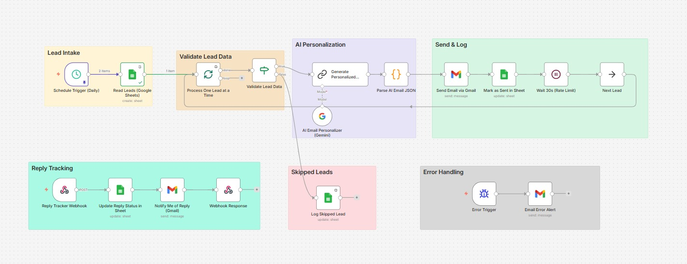

# 🤖 AI Cold Outreach System
 
An end-to-end n8n automation that finds pending leads in Google Sheets, writes a uniquely personalized cold email for each one using AI, sends it through Gmail, logs the result, and tracks replies — fully hands-off after setup.
 
Built as a portfolio/freelance-ready automation demonstrating LLM-powered personalization, multi-branch error handling, rate-limit-safe batch processing, and two-way Google Sheets sync.
 
---
 
## 🧩 Workflow Architecture
 

 
The workflow is organized into six functional zones:
 
| Zone | Purpose |
|---|---|
| 🟡 **Lead Intake** | Pulls all `Pending` leads from Google Sheets daily, processed one at a time |
| 🟠 **Validate Lead Data** | Filters out leads with missing email/name before they reach the AI step |
| 🟣 **AI Personalization** | Gemini generates a tailored subject + body per lead based on company, role, and industry context |
| 🟢 **Send & Log** | Sends the email via Gmail, updates the sheet, waits to respect rate limits, then loops to the next lead |
| 🩷 **Skipped Leads** | Invalid leads are flagged in the sheet for manual review instead of silently failing |
| 🔵 **Reply Tracking** | A separate webhook listens for reply events and updates lead status automatically |
| ⚫ **Error Handling** | Any workflow failure triggers an instant email alert with the error and node details |
 
---
 
## ✨ Features
 
- **Daily automated runs** — no manual triggering required
- **AI-personalized emails** — Gemini writes a custom subject and body per lead (not a mail-merge template)
- **Rate-limit safe** — processes one lead at a time with a 30s delay between sends
- **Self-healing JSON parsing** — handles AI responses even when wrapped in markdown code fences
- **Two-way sheet sync** — leads move through `Pending → Sent → Replied` (or `Invalid - Skipped`) automatically
- **Reply tracking via webhook** — get notified by email the moment a lead replies
- **Built-in error alerting** — workflow failures are emailed to you immediately, with the failing node and execution ID
---
 
## 🛠️ Tech Stack
 
- **n8n** — workflow orchestration
- **Google Gemini (gemini-1.5-flash)** — AI email generation
- **Google Sheets API** — lead storage and status tracking
- **Gmail API** — sending outreach emails and notifications
- **JavaScript (n8n Code node)** — safe AI response parsing
---
 
## 📋 Prerequisites
 
- An active [n8n](https://n8n.io) instance (self-hosted or cloud)
- A Google Cloud project with **Sheets API**, **Gmail API**, and **Generative Language API** enabled
- OAuth2 credentials configured in n8n for:
  - Google Sheets
  - Gmail
  - Google Gemini (PaLM) API key
---
 
## 📊 Google Sheet Schema
 
Create a sheet named `Leads` with these exact columns:
 
| Column | Description |
|---|---|
| `Name` | Lead's full name |
| `Company` | Company name |
| `Role` | Lead's job title |
| `Email` | Lead's email address |
| `Industry` | Lead's industry |
| `LinkedIn` | LinkedIn profile URL |
| `Website` | Company website |
| `Status` | `Pending` / `Sent` / `Replied` / `Invalid - Skipped` |
| `EmailSent` | `Yes` / blank |
| `ReplyReceived` | `Yes` / blank |
| `SentAt` | Timestamp, auto-filled |
| `Notes` | Any context to help personalize the email |
 
> New leads should be added with `Status = Pending`. The workflow handles the rest.
 
---
 
## ⚙️ Setup
 
1. **Import the workflow**
   - In n8n: `Workflows → Import from File` → select `ai_cold_outreach_n8n.json`
2. **Connect credentials**
   - Google Sheets OAuth2 → on `Read Leads`, `Mark as Sent in Sheet`, `Log Skipped Lead`, `Update Reply Status in Sheet`
   - Gmail OAuth2 → on `Send Email via Gmail`, `Notify Me of Reply`, `Email Error Alert`
   - Google Gemini API key → on `AI Email Personalizer (Gemini)`
3. **Update placeholders**
   - Replace `YOUR_GOOGLE_SHEET_ID` with your actual Sheet ID (found in the sheet's URL)
   - Replace `YOUR_EMAIL@gmail.com` with your real email (used for reply notifications and error alerts)
   - Replace `[YOUR NAME]`, `[YOUR PHONE]`, `[YOUR WEBSITE]` in the email signature
4. **Activate the workflow**
   - Toggle the workflow to **Active** so the daily schedule and webhook both go live
5. **(Optional) Connect reply detection**
   - Copy the **Reply Tracker Webhook** production URL
   - Point a reply-detection source at it (e.g. Gmail watch + Pub/Sub, or a polling script) with body:
```json
     { "email": "lead@example.com", "replyText": "Sounds great...", "repliedAt": "2026-06-27T10:00:00Z" }
```
 
---
 
## 🧪 Testing Without Live Data
 
To test the AI generation and email steps before connecting real leads, temporarily swap the `Read Leads` node for a Code/Set node returning mock data:
 
```json
[
  {
    "Name": "Ayesha Khan",
    "Company": "Northbridge Logistics",
    "Role": "Operations Manager",
    "Email": "ayesha.khan@example.com",
    "Industry": "Logistics & Supply Chain",
    "LinkedIn": "linkedin.com/in/ayeshakhan-ops",
    "Website": "northbridgelogistics.com",
    "Status": "Pending",
    "Notes": "Recently expanded to 3 new warehouses, likely managing dispatch manually"
  }
]
```
 
---
 
## 🔄 How It Works (Flow Summary)
 
```
Schedule Trigger (daily)
   → Read Pending Leads from Sheet
   → Process one lead at a time
   → Validate (email/name/status check)
        ✓ Valid   → AI generates personalized subject + body
                   → Send via Gmail
                   → Mark "Sent" in Sheet
                   → Wait 30s → Next Lead
        ✗ Invalid → Log as "Invalid - Skipped"
 
(Parallel) Reply Tracker Webhook
   → Update Sheet to "Replied"
   → Email notification
   → Respond 200 OK
 
(Parallel) Error Trigger
   → Email error alert with node + execution details
```
 
---
 
## 🚧 Known Limits & Notes
 
- Gmail's free-tier sending limit is ~500 emails/day — the 30s delay between sends is intentional and should not be reduced if sending in volume.
- Gemini free tier OAuth tokens expire weekly if your Google Cloud OAuth consent screen is still in "Testing" mode — publish the app or re-authenticate periodically.
- Reply detection is **not automatic** — it relies on an external trigger (Pub/Sub, Zapier, or a polling script) calling the webhook.
---
 
## 📈 Possible Extensions
 
- Swap Gemini for OpenAI or Groq (Llama 3.3) for generation
- Add A/B subject-line testing and track open/reply rates per variant
- Add a follow-up sequence for leads with `Status = Sent` after N days with no reply
- Connect to a CRM (HubSpot, Airtable) instead of Google Sheets for scale
---

## License

MIT License — free to use, modify, and adapt for your own projects.

---
 
## 👤 Author
 
**Hannan Faisal**
GitHub: [github.com/m-hannanfaisal](https://github.com/m-hannanfaisal)
 
Built as part of an ongoing portfolio of AI automation systems using n8n, LLM APIs, and Google Workspace integrations.
