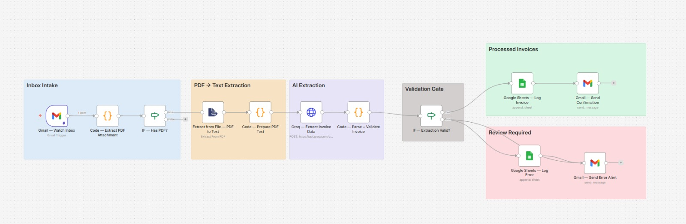

# 🧾 AI Invoice Processor — Gmail + Groq + Google Sheets

An automated invoice ingestion pipeline that watches a Gmail inbox for incoming invoice PDFs, extracts structured data using AI, validates it, and routes each invoice to either a "processed" log with an auto-confirmation, or a "needs review" log with an alert — with zero manual data entry on the happy path.

Built as a portfolio automation demonstrating AI-powered document extraction, PDF-to-text parsing, JSON validation, and conditional branching with full audit logging.

---

## 🧩 Workflow Architecture



The workflow is organized into six functional zones:

| Zone | Purpose |
|---|---|
| 🔵 **Inbox Intake** | Polls Gmail every 5 minutes, extracts PDF attachments, filters out emails with no PDF |
| 🟠 **PDF → Text Extraction** | Converts the PDF into plain text and trims it for AI processing |
| 🟣 **AI Extraction** | Groq (Llama 3.3 70B) reads the invoice text and returns structured JSON |
| ⚫ **Validation Gate** | Checks that vendor, total amount, and invoice date were all successfully extracted |
| 🟢 **Processed Invoices** | Valid invoices are logged to Sheets and the sender gets an automatic confirmation email |
| 🔴 **Review Required** | Incomplete extractions are logged separately and trigger an alert for manual review |

---

## ✨ Features

- **Fully automated intake** — no manual forwarding or copy-pasting invoice data
- **AI-powered extraction** — Groq's Llama 3.3 70B pulls vendor, dates, amounts, tax, line items, and payment terms from raw PDF text
- **Self-healing JSON parsing** — handles AI responses even if wrapped in markdown code fences
- **Built-in data validation** — invoices missing critical fields (vendor, total, date) are automatically flagged instead of silently logged as complete
- **Dual audit trail** — separate Sheets tabs for successfully processed invoices vs. ones needing review
- **Auto-confirmation emails** — senders get an instant "invoice received" reply with a summary
- **Error alerting** — you're emailed immediately when an invoice needs manual attention, with exactly what was/wasn't found

---

## 🛠️ Tech Stack

- **n8n** — workflow orchestration
- **Gmail Trigger + Gmail node** — inbox polling, attachment handling, sending replies
- **n8n Extract From File node** — PDF-to-text conversion
- **Groq API (Llama 3.3 70B Versatile)** — structured invoice data extraction via HTTP Request node
- **Google Sheets API** — dual-sheet logging (Invoices / Errors)
- **JavaScript (Code nodes)** — attachment parsing, text cleanup, AI response validation

---

## 📋 Prerequisites

- An active [n8n](https://n8n.io) instance (self-hosted or cloud)
- A Gmail account with OAuth2 credentials configured in n8n
- A [Groq API key](https://console.groq.com) (free tier available) set up as HTTP Header Auth credential in n8n
- A Google Sheet with two tabs: `Invoices` and `Errors`
- Google Sheets OAuth2 credentials configured in n8n

---

## 📊 Google Sheet Schema

### `Invoices` tab
| Column | Description |
|---|---|
| `Processed At` | Timestamp the invoice was processed |
| `Status` | Always `Processed` on this sheet |
| `Invoice Number` | Extracted invoice ID |
| `Invoice Date` | Extracted invoice date (`YYYY-MM-DD`) |
| `Due Date` | Extracted due date |
| `Vendor Name` | Extracted vendor/company name |
| `Vendor Email` | Extracted vendor email, if present |
| `Bill To` | Who the invoice was billed to |
| `Subtotal` | Subtotal before tax |
| `Tax Amount` | Tax amount |
| `Tax Rate` | Tax rate (as extracted, e.g. "8%") |
| `Total Amount` | Final total |
| `Currency` | Currency code (defaults to USD if not detected) |
| `Payment Terms` | Extracted payment terms |
| `Line Items` | Flattened string of all line items |
| `Confidence` | AI's self-reported confidence (High/Medium/Low) |
| `Email Subject` / `Email From` / `Attachment` | Source metadata |
| `Notes` | Any extraction notes |

### `Errors` tab
| Column | Description |
|---|---|
| `Timestamp` | When the failed extraction occurred |
| `Status` | Always `Review Required` |
| `Email Subject` / `Email From` / `Attachment` | Source metadata |
| `Missing Fields` | Which required fields couldn't be extracted |
| `Confidence` | AI's confidence rating |
| `Vendor Found` / `Amount Found` | Whatever partial data was extracted |
| `Notes` | Extraction error details |

---

## ⚙️ Setup

1. **Import the workflow**
   - In n8n: `Workflows → Import from File` → select `AI_Invoice_Processor.json`

2. **Connect credentials**
   - Gmail OAuth2 → on `Gmail — Watch Inbox`, `Gmail — Send Confirmation`, `Gmail — Send Error Alert`
   - Groq API key (HTTP Header Auth, header name `Authorization`, value `Bearer YOUR_GROQ_KEY`) → on `Groq — Extract Invoice Data`
   - Google Sheets OAuth2 → on `Google Sheets — Log Invoice`, `Google Sheets — Log Error`

3. **Update placeholders**
   - Replace `YOUR_GOOGLE_SHEET_ID_HERE` (appears on both Sheets nodes) with your actual Sheet ID
   - Replace `YOUR_ALERT_EMAIL_HERE` on `Gmail — Send Error Alert` with your real email

4. **Create the Google Sheet**
   - Create a spreadsheet with two tabs named exactly `Invoices` and `Errors`
   - Add the column headers listed above to each tab (the workflow appends rows by column name)

5. **Activate the workflow**
   - Toggle to **Active** — Gmail will be polled every 5 minutes automatically

---

## 🔄 How It Works (Flow Summary)

```
Gmail Trigger (poll every 5 min, unread + attachments)
   → Extract PDF attachment from email
   → IF has PDF?
        ✗ No  → skipped silently
        ✓ Yes → Extract PDF text
                → Clean/trim text (max 8000 chars)
                → Groq extracts structured invoice JSON
                → Parse + validate (vendor, total, date required)
                → IF extraction valid?
                     ✓ Valid   → Log to "Invoices" sheet
                                → Send confirmation email to sender
                     ✗ Invalid → Log to "Errors" sheet
                                → Send alert email to you
```

---

## 🧪 Testing Without Live Email

To test the extraction logic without waiting for a real invoice email, temporarily replace `Gmail — Watch Inbox` with a Code/Set node returning mock data, then feed it into `Code — Extract PDF Attachment`. You can also test the Groq extraction step in isolation by pinning sample PDF text directly into `Code — Prepare PDF Text` and pasting any invoice text as the `pdfText` field.

---

## 🚧 Known Limits & Notes

- Only works with **text-based PDFs** — scanned/image-only invoices will return empty extracted text. You'd need an OCR step (e.g. Tesseract or a cloud OCR API) added before the Groq extraction step to support those.
- The model is locked to `llama-3.3-70b-versatile` — swap the `model` field in the Groq HTTP Request body to use a different Groq-hosted model if needed.
- PDF text is capped at 8000 characters before being sent to Groq — very long multi-page invoices may get truncated.
- Validation only checks for `vendor_name`, `total_amount`, and `invoice_date` — extend the `requiredFields` array in `Code — Parse + Validate Invoice` if you need stricter checks (e.g. requiring `invoice_number`).

---

## 📈 Possible Extensions

- Add OCR fallback for scanned/image-based invoice PDFs
- Auto-categorize invoices by vendor or expense type using a second AI pass
- Push validated invoices into accounting software (QuickBooks, Xero) via their API instead of Sheets
- Add duplicate invoice detection (same invoice number + vendor) before logging
- Build a weekly digest summarizing total spend by vendor

---

##Lisence
MIT License — Copyright (c) 2026 Hannan Faisal

---

## 👤 Author

**Hannan Faisal**
GitHub: [github.com/m-hannanfaisal](https://github.com/m-hannanfaisal)

Built as part of an ongoing portfolio of AI automation systems using n8n, LLM APIs, and Google Workspace integrations.
