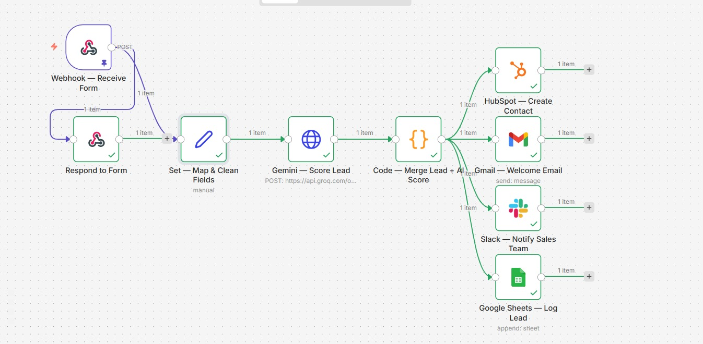

# 🤖 AI-Powered Lead Capture & CRM Automation Pipeline

An end-to-end automation that captures inbound leads, scores and qualifies them using AI, and instantly routes them into your CRM, inbox, Slack, and spreadsheet — all without a human touching a single lead until it's already prioritized.

Built with **n8n**, **Groq (Llama 3.3)**, and native integrations with **HubSpot**, **Gmail**, **Slack**, and **Google Sheets**.



---

## 💡 The Problem This Solves

Every business with an inbound form — a website contact form, a landing page, a "request a demo" button — faces the same bottleneck: leads pile up, and someone has to manually read each one, decide if it's worth pursuing, and then chase it across five different tools (CRM, email, Slack, spreadsheet).

That delay costs deals. Studies consistently show response time is one of the biggest predictors of lead conversion — and most sales teams take hours, not minutes.

This pipeline collapses that entire process into seconds:

**Form submitted → AI reads & scores the lead → routed everywhere it needs to be, instantly.**

---

## ⚙️ How It Works

1. **Webhook intake** — Any form (website, landing page, third-party tool) POSTs lead data to a webhook endpoint.
2. **Field mapping & cleanup** — Raw form data is normalized into a consistent structure (name, email, phone, company, message, source).
3. **AI lead scoring (Groq / Llama 3.3)** — The lead is analyzed by an LLM acting as a sales qualification assistant, returning:
   - A score: `Hot`, `Warm`, or `Cold`
   - A priority ranking (1–10)
   - A one-sentence reason for the score
   - A suggested first follow-up message
4. **Parsing & merge** — A Code node safely parses the AI's structured JSON response (with a graceful fallback if the AI call ever fails) and merges it back with the original lead data.
5. **Parallel routing** — The enriched lead fans out simultaneously to:
   - **HubSpot** → creates a new CRM contact
   - **Gmail** → sends the lead a personalized welcome/acknowledgment email
   - **Slack** → posts a formatted alert to the sales team's channel, including the AI score and suggested follow-up
   - **Google Sheets** → logs every lead to a running spreadsheet for reporting and history

---

## 🧱 Tech Stack

| Component | Tool |
|---|---|
| Orchestration | [n8n](https://n8n.io) (self-hosted or cloud) |
| AI Scoring | [Groq API](https://groq.com) running Llama 3.3 70B |
| CRM | HubSpot |
| Email | Gmail (OAuth2) |
| Team Alerts | Slack |
| Logging/Reporting | Google Sheets |

---

## 🔐 Production-Grade Details

This isn't a toy demo — it's built the way a real client deployment should be:

- **No hardcoded secrets.** All API keys and tokens live in n8n's credential store, never in node parameters or version control.
- **Structured AI output.** Uses Groq's JSON mode (`response_format: json_object`) to guarantee parseable responses, removing brittle regex/markdown-stripping logic.
- **Graceful failure handling.** If the AI call fails or returns malformed data, the pipeline falls back to a sane default (`Warm`, priority 5) instead of breaking the entire flow — a lead is never silently dropped just because the AI hiccuped.
- **Single source of truth.** Lead data is normalized once (Set node) and referenced consistently downstream, avoiding duplicated or drifting field mappings across branches.

---

## 🚀 Setup

### 1. Import the workflow
Import `workflow.json` into your n8n instance (Workflows → Import from File).

### 2. Connect your credentials
You'll need accounts/API access for:
- **Groq** — get a free API key at [console.groq.com](https://console.groq.com), add as a Header Auth credential (`Authorization: Bearer <key>`)
- **HubSpot** — Private App token with `crm.objects.contacts.write` scope
- **Gmail** — OAuth2 (n8n handles the Google sign-in flow)
- **Slack** — OAuth2 token, and invite the bot to your target channel
- **Google Sheets** — OAuth2, plus your own Sheet ID swapped into the node

### 3. Point your form at the webhook
Use n8n's generated webhook URL as the form's submission endpoint, or send a test POST manually:

```bash
curl -X POST https://your-n8n-instance.com/webhook/new-lead \
  -H "Content-Type: application/json" \
  -d '{
    "name": "Jane Doe",
    "email": "jane@example.com",
    "phone": "+1 555 123 4567",
    "company": "Acme Inc",
    "message": "Interested in your automation services",
    "source": "Website Form"
  }'
```

### 4. Activate
Toggle the workflow to **Active** in n8n once everything's tested end-to-end.

---

## 🛠️ Customization Ideas

This is built to be a template, not a one-off. Easy extensions for client work:

- Swap the lead-scoring criteria/prompt to match a specific industry (real estate, SaaS, agencies, etc.)
- Add a routing branch that only fires Slack/CRM actions for `Hot` leads, batching `Cold` leads into a weekly digest instead
- Swap HubSpot for Pipedrive, Salesforce, or Airtable — n8n has native nodes for most major CRMs
- Add a deduplication check against existing CRM contacts before creating new ones
- Pipe the AI's suggested follow-up message directly into an automated SMS or WhatsApp send

---

## 🧑‍💻 Available for Freelance Work

I build automation pipelines like this one for businesses that want to stop losing leads to slow manual processes. If you're looking for:

- Custom n8n/Zapier/Make workflows
- AI-powered lead qualification, customer support, or internal ops automation
- Integration work across CRMs, email, Slack, and spreadsheets

— let's talk. I scope, build, and document automations end-to-end, the way this repo is documented.

**Contact:** *hannanfaisal0507@gmail.com*

---

## 📄 License

MIT — feel free to fork, adapt, and use this as a starting point for your own automations.
