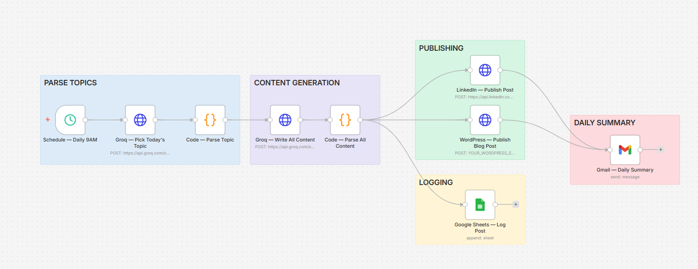

# 📈 Daily AI Social Media Pipeline
### Personal Finance & Investing — Automated Content Engine

> **Zero manual work. One post per day. Every day.**
> Groq AI picks a fresh topic, writes a LinkedIn post and full blog article, publishes both automatically, logs everything, and emails you a daily summary — all triggered at 9AM without you lifting a finger.

---

## 🧩 Workflow Architecture




---

## 📋 Table of Contents

- [Overview](#overview)
- [What It Does](#what-it-does)
- [Tech Stack](#tech-stack)
- [Workflow Architecture](#workflow-architecture)
- [Node Reference](#node-reference)
- [Sample Output](#sample-output)
- [Setup Guide](#setup-guide)
- [Configuration](#configuration)
- [Customization](#customization)
- [Business Value](#business-value)
- [License](#license)

---

## Overview

This n8n workflow is a fully automated content engine for the **Personal Finance & Investing** niche. It runs every morning without any human input, producing publication-ready content for LinkedIn and a WordPress blog.

Built for:
- Personal finance creators who want to stay consistent without burning out
- Marketing agencies managing multiple finance-niche clients
- Freelancers offering "done for you" social media automation services

---

## What It Does

Every day at 9:00 AM the pipeline:

1. **Picks a unique topic** — Groq AI selects a fresh Personal Finance angle based on the date, ensuring no two posts ever repeat
2. **Writes a LinkedIn post** — 150–250 words with a scroll-stopping hook, value-packed body, engagement-driving question, and 10 relevant hashtags
3. **Writes a blog article** — 400–600 words with SEO title, subheadings, practical examples in PKR amounts, and a call to action
4. **Publishes to LinkedIn** — via official LinkedIn UGC API, posted as public
5. **Publishes to WordPress** — via WordPress REST API, auto-published as a live post
6. **Logs everything** — every post, topic, angle, hook, and hashtags saved to Google Sheets as a content library
7. **Emails you a summary** — beautifully formatted HTML email showing exactly what went live

**Total time to run:** 25–40 seconds
**Human time required:** 0 minutes

---

## Tech Stack

| Tool | Role | Cost |
|---|---|---|
| **n8n** | Workflow automation engine | Free (self-hosted) |
| **Groq (LLaMA 3.3 70B)** | Topic picker + content writer | Free |
| **LinkedIn API** | Publish posts to LinkedIn | Free |
| **WordPress REST API** | Publish blog articles | Free |
| **Google Sheets API** | Content library + logging | Free |
| **Gmail** | Daily summary notifications | Free |

**Total monthly cost: $0**

---

## Workflow Architecture

```
                        ┌─────────────────────────────────────────┐
                        │           SCHEDULE TRIGGER               │
                        │         Every day at 9:00 AM            │
                        │          Mon – Sat (Cron: 0 9 * * 1-6) │
                        └──────────────────┬──────────────────────┘
                                           │
                                           ▼
                        ┌─────────────────────────────────────────┐
                        │         GROQ — PICK TODAY'S TOPIC       │
                        │  • Selects unique Personal Finance angle │
                        │  • Considers date to avoid repetition   │
                        │  • Returns: topic, angle, content_type  │
                        │    target_emotion                       │
                        └──────────────────┬──────────────────────┘
                                           │
                                           ▼
                        ┌─────────────────────────────────────────┐
                        │           CODE — PARSE TOPIC            │
                        │  • Parses Groq JSON response            │
                        │  • Fallback defaults if parse fails     │
                        │  • Attaches date + timestamp            │
                        └──────────────────┬──────────────────────┘
                                           │
                                           ▼
                        ┌─────────────────────────────────────────┐
                        │        GROQ — WRITE ALL CONTENT         │
                        │  • LinkedIn post (150-250 words)        │
                        │  • Blog article (400-600 words)         │
                        │  • 10 hashtags                          │
                        │  • SEO title + meta description         │
                        │  • Scroll-stopping hook line            │
                        └──────────────────┬──────────────────────┘
                                           │
                                           ▼
                        ┌─────────────────────────────────────────┐
                        │        CODE — PARSE ALL CONTENT         │
                        │  • Parses content JSON from Groq        │
                        │  • Cleans text for safe API use         │
                        │  • Combines post + hashtags             │
                        │  • Merges topic + content into one item │
                        └────────────┬─────────────┬─────────────┘
                                     │             │
                          ┌──────────┘    ┌────────┘
                          │               │
                          ▼               ▼
         ┌────────────────────┐  ┌─────────────────────┐
         │  LINKEDIN — POST   │  │  WORDPRESS — BLOG   │
         │  UGC API v2        │  │  REST API           │
         │  Public visibility │  │  Status: Published  │
         └────────┬───────────┘  └──────────┬──────────┘
                  │                          │
                  └──────────┬───────────────┘
                             │
                             ▼
         ┌───────────────────────────────────┐
         │       GMAIL — DAILY SUMMARY       │
         │  HTML email with full post        │
         │  preview, topic, blog title       │
         └───────────────────────────────────┘

         ┌───────────────────────────────────┐
         │    GOOGLE SHEETS — LOG POST       │
         │  Appends row: date, topic,        │
         │  post text, blog title, status    │
         └───────────────────────────────────┘
```

---

## Node Reference

| # | Node | Type | Purpose |
|---|---|---|---|
| 1 | Schedule — Daily 9AM | Schedule Trigger | Fires the workflow Mon–Sat at 9AM |
| 2 | Groq — Pick Today's Topic | HTTP Request | LLaMA 3.3 picks a unique PF topic |
| 3 | Code — Parse Topic | Code | Parses topic JSON, adds fallback |
| 4 | Groq — Write All Content | HTTP Request | Writes LinkedIn post + blog article |
| 5 | Code — Parse All Content | Code | Parses + cleans all generated content |
| 6 | LinkedIn — Publish Post | HTTP Request | Posts to LinkedIn via UGC API |
| 7 | WordPress — Publish Blog Post | HTTP Request | Publishes article via REST API |
| 8 | Google Sheets — Log Post | Google Sheets | Appends row to content library |
| 9 | Gmail — Daily Summary | Gmail | Sends formatted summary email |

---

## Sample Output

### Topic picked by AI
```
Topic:          "Why your savings account is secretly making you poorer"
Angle:          "Inflation vs savings rate — the silent wealth killer"
Content type:   statistic
Target emotion: fear → motivation
```

### LinkedIn post (AI-generated)
```
Your savings account has a dirty secret.

While you feel safe watching your balance grow from PKR 500,000
to PKR 515,000 — inflation just turned that into PKR 488,000
in real purchasing power.

A 3% savings rate cannot beat 6% inflation. Every year you
"save" in a traditional account, you lose 3% of your wealth.

Here's what actually works:
→ Government Sukuk bonds: 17-19% returns
→ Index funds via Meezan/Al Meezan: 12-18% annually
→ T-bills for short-term: currently above 20%

The rich don't save money. They deploy it.

What's your current savings rate doing vs inflation?
Drop it in the comments — let's see where Pakistan stands.

#PersonalFinance #Investing #Pakistan #WealthBuilding
#MoneyTips #FinancialFreedom #Savings #Inflation #PKR #Finance
```

### Blog article title
```
"Is Your Savings Account Making You Poorer? The Inflation Truth Pakistani Savers Need to Hear"
```

### Google Sheets row logged
```
Date          | Topic                      | Hook                          | Status    | Platform
2026-06-25    | Savings accounts vs infl.. | Your savings account has a... | Published | LinkedIn + WordPress
```

---

## Setup Guide

### Prerequisites
- n8n installed (self-hosted or n8n.cloud)
- Groq account at console.groq.com (free)
- LinkedIn account with developer app
- WordPress site (self-hosted or wordpress.com business)
- Google account (for Sheets + Gmail)

### Step 1 — Import workflow
1. Open n8n → click the menu → Import from file
2. Upload `social_media_pipeline.json`
3. All 9 nodes appear connected

### Step 2 — Connect Groq
1. Click either Groq node → Credentials
2. Select `Groq API Key` (already set up from previous projects)
3. Repeat for both Groq nodes

### Step 3 — Set up LinkedIn API
1. Go to **linkedin.com/developers** → Create App
2. Add `w_member_social` product permission
3. Generate OAuth 2.0 access token via the OAuth flow
4. Get your Person ID:
   ```
   GET https://api.linkedin.com/v2/me
   Authorization: Bearer YOUR_TOKEN
   ```
5. In the LinkedIn node replace:
   - `YOUR_LINKEDIN_ACCESS_TOKEN_HERE`
   - `YOUR_LINKEDIN_PERSON_ID_HERE`

### Step 4 — Set up WordPress
1. In WordPress go to **Users → Profile → Application Passwords**
2. Create a new application password
3. Encode credentials in Base64:
   ```
   echo -n "username:app_password" | base64
   ```
4. In the WordPress node replace:
   - `YOUR_WORDPRESS_SITE_URL_HERE` (e.g. `https://myblog.com`)
   - `YOUR_WORDPRESS_BASE64_CREDENTIALS_HERE`

### Step 5 — Set up Google Sheets
1. Create a new Google Sheet
2. Name the first tab `Posts`
3. Add headers in row 1:
   ```
   Date | Topic | Angle | Content Type | LinkedIn Hook | LinkedIn Post | Hashtags | Blog Title | SEO Description | Status | Platform
   ```
4. Copy the Sheet ID from the URL
5. Replace `YOUR_GOOGLE_SHEET_ID_HERE` in the Sheets node
6. Connect `Google Sheets Account` credential

### Step 6 — Configure Gmail
1. Connect `Gmail Account` credential in the Gmail node
2. Replace `YOUR_EMAIL_HERE` with your email address

### Step 7 — Test
1. Click **Execute workflow** manually
2. Check LinkedIn — post should appear within 30 seconds
3. Check WordPress — blog post published
4. Check your email — summary arrives
5. Check Google Sheets — new row logged

### Step 8 — Activate
Click **Publish** to activate the workflow. It will now fire automatically every morning at 9AM Monday to Saturday.

---

## Configuration

### Change the schedule
Find the cron expression in the Schedule node:
```
0 9 * * 1-6     → 9AM Mon-Sat (current)
0 8 * * 1-7     → 8AM every day
0 9,17 * * 1-5  → 9AM and 5PM Mon-Fri (twice daily)
```

### Change the niche
In **Groq — Pick Today's Topic**, find the system prompt and replace all references to "Personal Finance" with your niche. Example niches that work well:
- Health & Wellness
- Digital Marketing
- Real Estate Investing
- Entrepreneurship & Startups
- Parenting & Family

### Change the audience
In **Groq — Write All Content**, find this line in the user message:
```
Audience: Pakistani and South Asian professionals aged 22-40
```
Change it to match your actual target audience.

### Change posting time
Edit the cron expression in the Schedule node. Use crontab.guru to build custom schedules.

---

## Customization Ideas

**Add Twitter/X posting**
Add an HTTP Request node after Code — Parse All Content → POST to `api.twitter.com/2/tweets` with the LinkedIn post text (truncated to 280 chars).

**Add image generation**
Add a Replicate or DALL-E node between content generation and publishing → generate a relevant finance graphic → attach to WordPress post.

**Add approval step before publishing**
Insert an n8n Form node or Slack message with Approve/Reject buttons — the workflow pauses until you approve the content before it goes live.

**Multi-language support**
Add a second Groq node that translates the content to Urdu or Arabic for regional reach.

**Topic tracking to avoid repeats**
Add a Google Sheets read step at the start — pass the last 30 topics to Groq so it explicitly avoids them.

---

## Business Value

### For personal brands
| Metric | Before automation | After automation |
|---|---|---|
| Time spent on content | 3–5 hours/week | 0 minutes |
| Posts per week | 2–3 (inconsistent) | 6 (every day) |
| Content quality | Variable | Consistently high |
| Topic research time | 30–60 min/post | 0 minutes |

### For freelancers
This workflow is a productized service. Package it as:

**Starter Gig (Fiverr):** $150–$250
- Set up the workflow for one niche
- Connect to client's LinkedIn + WordPress
- 7 days of test posts included

**Pro Package (Upwork):** $400–$700
- Full setup + customization
- 3 niches supported
- Monthly maintenance retainer: $100–$150/mo

**Agency Package:** $800–$1,500
- Multi-client dashboard
- Weekly performance report (Google Sheets)
- Content approval workflow

---

## Files

```
social_media_pipeline.json        — n8n workflow (import directly)
README.md                         — this file
social-media-automation.png
```

---

## Author

Built by **Hannan Faisal** 

Specializing in n8n workflows, Groq AI integrations, and business content automation for freelance clients across Fiverr and Upwork.

Portfolio projects:
- Lead Capture & CRM Pipeline
- WhatsApp AI Booking Bot
- Full CRM Automation Suite (HubSpot + Groq)
- AI Invoice Processor
- Daily AI Social Media Pipeline ← this project

---

## License

MIT License

Copyright (c) 2026 Hannan Faisal

Permission is hereby granted, free of charge, to any person obtaining a copy
of this software and associated documentation files (the "Software"), to deal
in the Software without restriction, including without limitation the rights
to use, copy, modify, merge, publish, distribute, sublicense, and/or sell
copies of the Software, and to permit persons to whom the Software is
furnished to do so, subject to the following conditions:

The above copyright notice and this permission notice shall be included in all
copies or substantial portions of the Software.

THE SOFTWARE IS PROVIDED "AS IS", WITHOUT WARRANTY OF ANY KIND, EXPRESS OR
IMPLIED, INCLUDING BUT NOT LIMITED TO THE WARRANTIES OF MERCHANTABILITY,
FITNESS FOR A PARTICULAR PURPOSE AND NONINFRINGEMENT. IN NO EVENT SHALL THE
AUTHORS OR COPYRIGHT HOLDERS BE LIABLE FOR ANY CLAIM, DAMAGES OR OTHER
LIABILITY, WHETHER IN AN ACTION OF CONTRACT, TORT OR OTHERWISE, ARISING FROM,
OUT OF OR IN CONNECTION WITH THE SOFTWARE OR THE USE OR OTHER DEALINGS IN THE
SOFTWARE.

---

*Built with n8n · Groq AI · LinkedIn API · WordPress REST API · Google Sheets*
