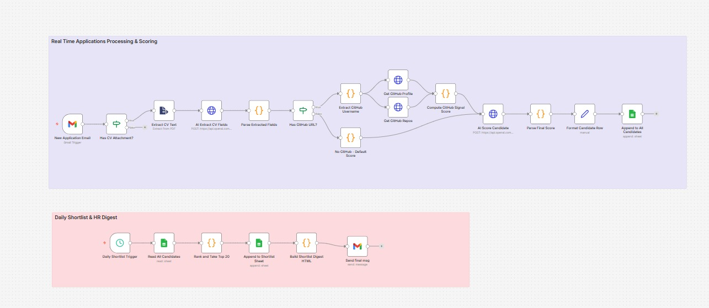

# Applicant Screening Engine — CV + GitHub Signal Scoring

An n8n automation that turns incoming job application emails into a ranked, AI-scored candidate shortlist — combining resume parsing, GitHub activity analysis, and LLM-based fit scoring, with a daily HR digest delivered straight to your inbox.

> ⚠️ **This is a screening aid, not a hiring decision tool.** All scores include reasoning and are meant to help a human reviewer prioritize, not replace their judgment.

---

## What it does

The workflow is split into two independent flows:

### 1. Real-Time Applications Processing & Scoring
Triggered every time a new application email arrives, this flow:
1. **Watches Gmail** for new application emails (`New Application Email`).
2. **Checks for a CV attachment** — emails without one are dropped (`Has CV Attachment?`).
3. **Extracts text from the CV PDF** (`Extract CV Text`).
4. **Uses an LLM (GPT-4o-mini)** to pull structured fields — name, email, phone, years of experience, skills, education, GitHub/LinkedIn URLs, and a one-line summary (`AI Extract CV Fields` → `Parse Extracted Fields`).
5. **Checks if a GitHub URL was found** (`Has GitHub URL?`):
   - **If yes:** extracts the username, pulls the GitHub profile and the 10 most recently updated repos, then computes a **0–5 GitHub Signal Score** based on:
     - 5+ public repos
     - Active in the last 6 months
     - 2+ languages used
     - 5+ followers
     - At least one repo with a meaningful description
   - **If no:** assigns a default GitHub score of `0`.
6. **Sends the candidate profile to GPT-4o-mini for final scoring** against a configurable role (default: *Backend Engineer, 3+ years, Node.js/Python, cloud infra preferred*). The AI returns a **0–10 score** plus a one-sentence reasoning, weighted as:
   - Skills match: 0–4
   - Years of relevant experience: 0–3
   - GitHub signal: 0–3 (scaled from the GitHub Signal Score)
7. **Appends the full candidate record** — fields, GitHub stats, final score, and reasoning — to a **Google Sheet ("All Candidates")**.

### 2. Daily Shortlist & HR Digest
Runs on a schedule and:
1. **Reads every row** from the `All Candidates` sheet.
2. **Ranks by final AI score** and keeps the **top 20**.
3. **Appends the shortlist** to a separate `Shortlist` sheet (so history is preserved run over run).
4. **Builds an HTML digest table** (name, score, skills, years of experience, reasoning, GitHub/LinkedIn links).
5. **Emails the digest** to HR via Gmail.

---

## Workflow diagram

| Flow | Color | Trigger |
|---|---|---|
| Real Time Applications Processing & Scoring | Purple | Gmail — new email |
| Daily Shortlist & HR Digest | Pink | Schedule |

---

## Requirements

| Service | Used for | Credential type in workflow |
|---|---|---|
| **Gmail** | Watching for new applications, sending the HR digest | OAuth2 (`gmailOAuth2`) |
| **OpenAI API** | CV field extraction + candidate scoring (GPT-4o-mini) | `openAiApi` |
| **GitHub API** | Pulling profile + repo data for the signal score | `githubApi` |
| **Google Sheets** | Storing all candidates and the daily shortlist | Service Account |

You'll need active accounts/API keys for all four, connected as credentials inside n8n before importing this workflow.

---

## Setup

1. **Import the workflow** into n8n (`Applicant_Screening_Engine_-_CV___GitHub_Signal_Scoring.json`).
2. **Connect credentials** for Gmail, OpenAI, GitHub, and Google Sheets (service account).
3. **Create a Google Sheet** with two tabs:
   - `All Candidates` — receives every scored applicant
   - `Shortlist` — receives the daily top-20 snapshot
4. **Update the Google Sheets nodes:**
   - `Append to All Candidates`, `Read All Candidates`, `Append to Shortlist Sheet` — replace the placeholder/sample Sheet ID with your own spreadsheet ID.
5. **Update the Gmail trigger** to point at the inbox that receives applications, and check the polling interval (default: every minute).
6. **Update `Send final msg`** — set the real HR recipient address and adjust the subject/intro text if desired.
7. **Adjust the scoring rubric** in `AI Score Candidate` — the system prompt currently targets a *Backend Engineer (3+ yrs, Node.js/Python, cloud infra)* role. Edit this prompt to match the role(s) you're actually hiring for.
8. **Set the shortlist schedule** in `Daily Shortlist Trigger` — it currently runs on a minutes interval; change this to a daily cron (e.g., 9:00 AM) for production use.
9. **Activate both flows.**

---

## Sheet schema (auto-mapped)

Each row appended to `All Candidates` / `Shortlist` includes:

| Field | Description |
|---|---|
| `name`, `email`, `phone` | Parsed from CV |
| `yearsExperience` | Parsed from CV |
| `skills` | Array of skills parsed from CV |
| `education` | Parsed from CV |
| `githubUrl`, `linkedinUrl` | Parsed from CV (if present) |
| `summary` | One-line AI-generated summary |
| `githubUsername` | Extracted from GitHub URL |
| `githubScore` | 0–5 signal score |
| `githubRepoCount`, `githubLanguages`, `githubRecentlyActive` | Raw GitHub signal data |
| `finalScore` | 0–10 AI-generated fit score |
| `scoreReasoning` | One-sentence AI explanation for the score |

---

## Notes & limitations

- **CV parsing depends on PDF text extraction** — scanned/image-based CVs without selectable text won't extract correctly.
- **GitHub scoring only fires if a GitHub URL is present and parseable** in the CV; candidates without one default to a score of `0`, which is *not* a penalty by design — just a missing data point.
- **The AI scores are heuristic, not authoritative.** Always read the `scoreReasoning` column before acting on a score.
- **Rate limits:** GitHub's unauthenticated/standard API and OpenAI's API both have rate limits — high application volume may need batching or queueing added.
- The current OpenAI model is `gpt-4o-mini`; swap this in both HTTP Request nodes if you want a different model.

---

## Customization ideas

- Swap the Gmail trigger for a job board webhook (LinkedIn, Indeed, a careers-page form) if applications don't arrive by email.
- Add a Slack notification alongside/instead of the email digest.
- Extend the GitHub signal score with contribution graph data or pinned-repo quality checks.
- Add deduplication (by email) before appending to `All Candidates` so re-applications don't create duplicate rows.
