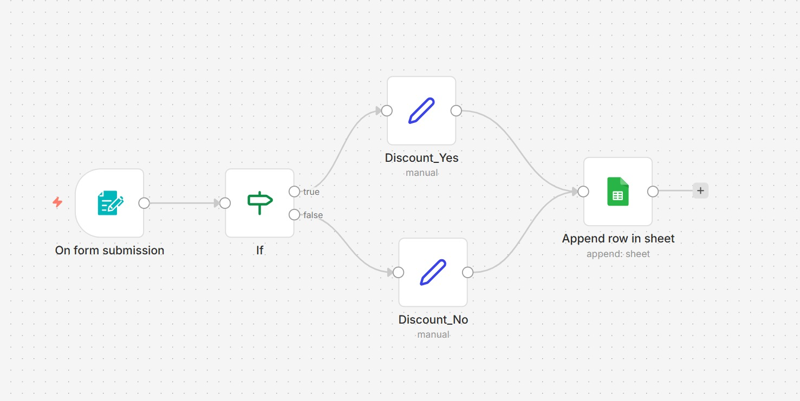

# 🎯 Customer Feedback Discount Decision (n8n)

## Overview

This project is a simple business automation workflow built with **n8n**.

The workflow receives customer feedback from a form submission, evaluates whether the customer should receive a discount based on predefined conditions, and stores the result in Google Sheets.

This project was created as part of my AI Automation learning journey.

---

## Workflow

---

## Features

- 📝 Triggered by form submission
- 🔀 Decision-making using an IF node
- 🎁 Determines whether a discount should be offered
- 📊 Stores the final result in Google Sheets

---

## Technologies Used

- n8n
- Form Trigger
- IF Node
- Set/Edit Fields
- Google Sheets

---

## Workflow Steps

1. Customer submits the feedback form.
2. The workflow evaluates the submitted data.
3. If the conditions are satisfied, a discount is assigned.
4. Otherwise, no discount is given.
5. The result is appended to a Google Sheet.

---

## Learning Outcomes

Through this project I learned:

- Creating conditional logic in n8n
- Using IF nodes for decision making
- Working with Google Sheets integration
- Processing form submissions
- Building simple business automation workflows

---

> This project is part of my AI Automation learning portfolio. More workflows will be added as I continue learning.
