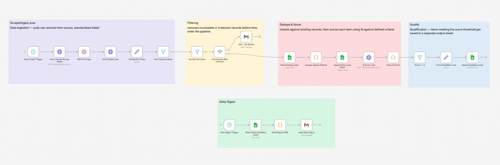

# Hiring Signal Lead Engine

**An autonomous lead-generation pipeline that turns public job postings into a scored, qualified sales list — delivered to your inbox every morning, with zero manual research.**

*(see the workflow diagram screenshot in this repo)*

---

## The Problem

Sales and freelance teams spend hours every week manually browsing job boards, trying to spot companies that are quietly signaling a need for a specific product or service — then copying that into a spreadsheet, then deciding which leads are actually worth pursuing.

That process doesn't scale, it's inconsistent (every researcher applies different judgment), and by the time a human gets to a posting, the signal is often stale.

## The Solution

This workflow automates the entire pipeline end-to-end:

> **Scrape → Filter → Dedupe → AI-Score → Qualify → Deliver**

Every morning, it pulls fresh job postings, strips out noise (recruiters, incomplete listings), checks them against everything already seen, scores each one against a defined buying-signal rubric using an LLM, and emails a clean, ranked digest of only the leads worth acting on — all without a human touching it.

This is built to be **adapted to any market signal**: the scoring criteria, source, and target audience are all configurable. As shipped, it's tuned for one use case, but the underlying engine works for any "find companies showing X signal" problem.

---

## How It Works

### 1. Data Ingestion
A scheduled trigger kicks off a scraping job against a target source, retrieves the raw listings, and standardizes every record into a consistent schema (company, title, description, URL, posted date) regardless of source formatting quirks.

### 2. Filtering
Removes records with no identifiable company name and excludes recruiting/staffing agencies — so the pipeline only scores leads that represent real hiring companies, not intermediaries.

### 3. Dedupe & Score
Cross-references every new record against previously processed leads (stored in Google Sheets) to avoid re-analyzing the same company twice. Surviving records are sent to an LLM with a structured scoring rubric, returning a 0–5 score plus a one-sentence justification for full transparency into *why* a lead qualified.

### 4. Qualification
Leads scoring above the threshold are appended to a separate "Qualified Leads" output — keeping the noisy raw data and the high-confidence shortlist cleanly separated.

### 5. Daily Digest
A second, independently scheduled trigger reads that day's qualified leads and emails a formatted HTML summary — company, role, score, reasoning, and a direct link — so the only thing left to do is decide who to contact.

---

## Why This Design Is Production-Minded, Not Just a Demo

- **Two independent schedules, not one brittle chain** — the digest doesn't depend on the scrape finishing successfully; if the digest were chained directly to the scrape, a slow scrape would mean no email that day. Decoupling them makes the system more resilient.
- **Failure alerting built in** — if a scrape returns zero usable results, the system emails an alert immediately instead of silently going stale, which is what usually happens with scraper-based pipelines once a source changes its page structure.
- **Deduplication against historical state** — prevents the same company from being scored (and billed for, if using a paid LLM) more than once.
- **Transparent AI scoring** — every score comes with a one-sentence reasoning string, so a human reviewing the digest can sanity-check the AI's judgment rather than trusting a black-box number.
- **Clean separation of raw vs. qualified data** — raw scraped data and the curated shortlist live in separate sheets, so nothing valuable gets buried in noise.

---

## Tech Stack

| Layer | Tool |
|---|---|
| Orchestration | n8n |
| Scraping | Apify |
| AI Scoring | OpenAI API (gpt-4o-mini) |
| Data Storage | Google Sheets |
| Delivery | Gmail API |

---

## Workflow Architecture

| Section | Nodes | Purpose |
|---|---|---|
| **Scrape/Ingest** | Daily Scrape Trigger → Start Scrape (Apify) → Wait → Get Scraped Jobs → Standardize Fields → Has Company Name | Pulls and normalizes raw listings |
| **Filtering** | Exclude Recruiters → Zero Results After Filtering? → *(Alert - No Results, if empty)* | Removes noise, catches silent failures |
| **Dedupe & Score** | Read Existing Leads → Dedupe Against Existing → Append New Leads (Raw) → AI Score Lead → Parse AI Score | Avoids reprocessing, applies AI judgment |
| **Qualify** | Score ≥ 3 → Format Qualified Lead → Append Qualified Leads | Separates high-confidence leads from raw data |
| **Daily Digest** *(independent schedule)* | Daily Digest Trigger → Read Today's Qualified Leads → Build Digest HTML → Send Daily Digest | Delivers the finished output, decoupled from ingestion |

---

## Setup

1. Import `hiring-signal-lead-engine.json` into n8n
2. Configure credentials:
   - **Apify** API token
   - **OpenAI** API key
   - **Google Sheets** OAuth2
   - **Gmail** OAuth2
3. Replace placeholder values (`YOUR_SHEET_ID`, `YOUR_APIFY_TOKEN`, recipient emails) with your own
4. Adjust the scoring rubric inside the "AI Score Lead" node's system prompt to match whatever buying signal you're targeting
5. Activate both scheduled triggers

---

## Adapting This For a New Use Case

The scoring logic, source, and audience are all swappable:
- **Change the source** — swap the Apify actor for any job board, directory, or public listing source
- **Change the rubric** — rewrite the system prompt criteria to score for any signal (e.g. "company recently raised funding," "no existing CRM mentioned," "team is hiring multiple roles in one function")
- **Change the delivery** — swap Gmail for Slack, a CRM webhook, or any other destination

This is the core value of the design: it's not a one-off script, it's a reusable lead-qualification engine.

---

*Built with n8n as part of an ongoing portfolio of AI automation projects. See [github.com/m-hannanfaisal](https://github.com/m-hannanfaisal) for more.*
---
##License

MIT License — free to use, modify, and adapt for your own projects.
