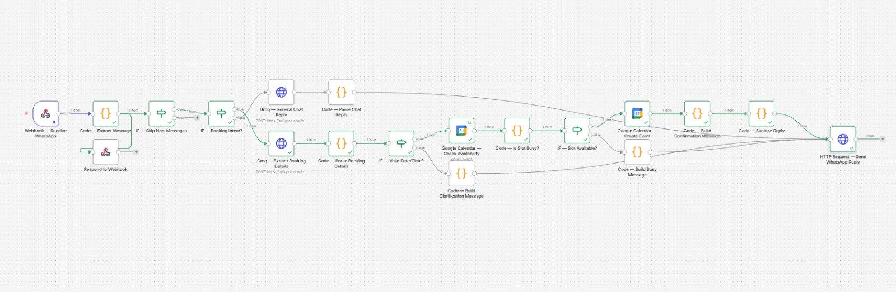

# 🤖 WhatsApp AI Booking Bot
### Automated Appointment Booking via WhatsApp using n8n, Groq AI & Google Calendar

---

## 📌 Project Overview

A fully automated WhatsApp chatbot that handles customer conversations, understands natural language booking requests, checks real-time calendar availability, and confirms appointments — all without any human involvement.

Built as a freelance-ready automation that any local business (clinics, salons, tutors, restaurants, real estate agents) can deploy to save 2–3 hours per day of manual WhatsApp management.

---

## 🎯 What It Does

A customer sends a WhatsApp message like *"I want to book tomorrow at 2pm"* and the bot:

1. Receives the message instantly via Meta Cloud API
2. Detects whether it's a booking request or a general question
3. If booking → extracts the date, time, and customer name using Groq AI
4. Snaps the request to the nearest valid 30-minute slot
5. Checks Google Calendar for availability in real time
6. If slot is free → creates the calendar event and sends a confirmation
7. If slot is busy → apologizes and asks for another time
8. If date/time is unclear → sends the full list of available slots
9. If general question → Groq AI answers conversationally

**All of this happens in under 5 seconds, 24/7, with zero human intervention.**

---

## 📸 Bot in Action



---


## 🛠️ Tech Stack

| Tool | Purpose |
|---|---|
| **n8n** | Workflow automation engine |
| **Meta Cloud API** | WhatsApp Business messaging |
| **Groq (LLaMA 3.3 70B)** | AI chat replies + booking detail extraction |
| **Google Calendar API** | Availability check + event creation |
| **Cloudflare Tunnel / ngrok** | Local → public webhook exposure |

---

## ⚙️ Workflow Architecture

```
WhatsApp Message
      ↓
Meta Cloud API (webhook POST)
      ↓
n8n Webhook Node
      ↓
Code Node — Extract sender, message, phone number
      ↓
IF — Skip status updates / verification pings
      ↓
IF — Booking intent? (regex keyword detection)
      ↓
    ┌──────────────────────────────────────┐
    │ YES (booking)      │ NO (general)    │
    ↓                    ↓                 │
Groq — Extract      Groq — Chat reply     │
date/time/name      (conversational)      │
    ↓                    ↓                 │
Code — Parse        Code — Parse reply    │
& validate          & carry phone data    │
    ↓                                     │
IF — Valid date/time?                     │
    ↓                                     │
Google Calendar — Check availability      │
    ↓                                     │
Code — Is slot busy?                      │
    ↓                                     │
IF — Slot available?                      │
    ↓                ↓                    │
Create event    Build busy message        │
    ↓                ↓                    │
Confirmation    Ask for new time          │
message              │                    │
    └────────────────┴────────────────────┘
                      ↓
           Code — Sanitize reply text
                      ↓
           HTTP Request — Send WhatsApp reply
                      ↓
           Customer receives message on WhatsApp ✅
```

---

## 📅 Business Rules Enforced

- **Working days:** Monday – Saturday only (Sundays rejected gracefully)
- **Working hours:** 10:00 AM – 7:00 PM
- **Slot duration:** 30 minutes
- **Valid slots:** 10:00, 10:30, 11:00 ... 18:00, 18:30
- **Smart rounding:** "2:10pm" → 14:00 | "2:20pm" → 14:30
- **Natural language:** "Tomorrow at 3pm", "Next Friday morning" all understood

---

## 💬 Example Conversations

**Booking a slot:**
```
User:  I want to book an appointment tomorrow at 2pm
Bot:   ✅ Booked! Your appointment is confirmed for:
       📅 Thursday, June 25, 2026
       🕐 02:00 PM

       You'll receive a reminder before your appointment.
       See you then! 😊
```

**Slot already taken:**
```
User:  Can I book Friday at 3pm?
Bot:   Sorry, Friday at 3:00 PM is already booked. 😔

       Our available slots are every 30 minutes,
       Monday–Saturday from 10:00 AM to 7:00 PM.

       Could you suggest another time? 🙏
```

**Out of hours request:**
```
User:  Book me Sunday at 9pm
Bot:   Sorry, we're closed on Sundays. 😊

       We're open Monday to Saturday, 10:00 AM – 7:00 PM.
       Which other day works for you?
```

**General question:**
```
User:  What services do you offer?
Bot:   We offer a range of services tailored to your needs!
       Feel free to ask about anything specific or say a
       date and time to book an appointment. 😊
```

---

## 🗂️ Workflow Nodes (16 total)

| # | Node | Type | Purpose |
|---|---|---|---|
| 1 | Webhook — Receive WhatsApp | Webhook | Receives all Meta POST/GET requests |
| 2 | Code — Extract Message | Code | Parses nested Meta JSON, extracts message data |
| 3 | Respond to Webhook | Respond | Sends 200 OK + verification challenge |
| 4 | IF — Skip Non-Messages | IF | Filters out status updates and pings |
| 5 | IF — Booking Intent? | IF | Regex keyword detection for booking vs chat |
| 6 | Groq — General Chat Reply | HTTP Request | Conversational AI for non-booking messages |
| 7 | Code — Parse Chat Reply | Code | Extracts Groq response text |
| 8 | Groq — Extract Booking Details | HTTP Request | AI extracts date, time, name from message |
| 9 | Code — Parse Booking Details | Code | Validates, snaps to slot, builds ISO datetimes |
| 10 | IF — Valid Date/Time? | IF | Routes valid vs unclear booking requests |
| 11 | Google Calendar — Check Availability | Google Calendar | Checks if requested slot is free |
| 12 | Code — Is Slot Busy? | Code | Interprets calendar response |
| 13 | IF — Slot Available? | IF | Routes to booking or busy message |
| 14 | Google Calendar — Create Event | Google Calendar | Creates confirmed appointment |
| 15 | Code — Build Messages (×3) | Code | Builds confirmation/busy/clarification replies |
| 16 | HTTP Request — Send WhatsApp Reply | HTTP Request | Sends reply via Meta Cloud API |

---

## 🔧 Setup Requirements

### Accounts Needed (all free)
- **Meta Developer Account** — developers.facebook.com
- **WhatsApp Business API** — added as product in Meta app
- **Groq Account** — console.groq.com (no credit card)
- **Google Account** — for Google Calendar OAuth
- **n8n** — self-hosted or n8n.cloud
- **Cloudflare Tunnel or ngrok** — for local webhook exposure

### Credentials to Configure
| Credential | Where to get it |
|---|---|
| Meta Access Token | Meta Dashboard → WhatsApp → API Setup |
| Groq API Key | console.groq.com → API Keys |
| Google Calendar OAuth | n8n credential → Sign in with Google |

### Environment Variables / Customizable Settings
```
VERIFY_TOKEN      = your custom Meta webhook verify token
SLOT_DURATION     = 30 (minutes)
WORK_START_HOUR   = 10 (10am)
WORK_END_HOUR     = 18 (6pm, last slot 18:30)
WORK_DAYS         = [1,2,3,4,5,6] (Mon-Sat)
```

---

## 🚀 How to Deploy

1. Clone or import `whatsapp_ai_booking_bot.json` into n8n
2. Set up all 3 credentials (Groq, Google Calendar, Meta token in header)
3. Start tunnel: `npx cloudflared tunnel --url http://localhost:5678`
4. Publish workflow in n8n
5. Paste tunnel URL into Meta → WhatsApp → Configuration → Webhook
6. Subscribe to `messages` webhook field
7. Add your WhatsApp number as test recipient in Meta dashboard
8. Send a message to the bot number and watch it work

---

## 💰 Business Value

| Metric | Value |
|---|---|
| Time saved per day | 2–3 hours of manual replies |
| Response time | Under 5 seconds, 24/7 |
| Languages supported | Any (Groq handles multilingual) |
| Simultaneous conversations | Unlimited |
| Monthly API cost | ~$0 (all free tiers) |

**Target clients:** Clinics, dental offices, salons, tutoring centers, real estate agents, restaurants, fitness trainers — any business that takes appointments via WhatsApp.

**Freelance pricing:** $300–$600 to build + $80–$150/month maintenance retainer.

---

## 📁 Files

```
whatsapp_ai_booking_bot.json    — n8n workflow (import directly)
README.md                       — this file
whatsapp_bot.jpeg
```

---

## 👨‍💻 Author

Built by **Hannan Faisal** as part of an AI automation freelance portfolio.

Specializing in n8n workflows, AI integrations, and business process automation.

---

## 📄 License

MIT — free to use, modify, and deploy for client projects.
