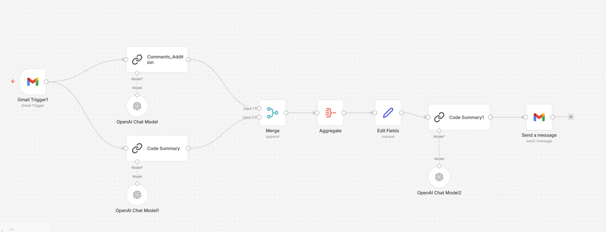

# 📄 AI Code Summarizer (n8n)

## Overview

This project is a beginner AI automation workflow built with **n8n**.

The workflow monitors incoming Gmail messages containing source code, uses AI to analyze the code and generate comments and a summary, then emails the summarized result back to the sender.

This project was created as part of my AI Automation learning journey.

---

## Workflow

---

## Features

- 📩 Triggered by a new Gmail message
- 🤖 Generates comments for the submitted code
- 📝 Creates an easy-to-understand code summary
- 🔀 Merges AI outputs into a single response
- ✉️ Sends the summarized result back via Gmail

---

## Technologies Used

- n8n
- Gmail Trigger
- OpenAI Chat Model
- AI Chain Nodes
- Merge Node
- Aggregate Node
- Gmail

---

## Workflow Steps

1. Gmail receives a new email.
2. The code is sent to an AI model for commenting.
3. The same code is summarized by another AI chain.
4. Both outputs are merged together.
5. The final response is formatted.
6. The completed summary is emailed back to the user.

---

## Learning Outcomes

Through this project I learned:

- Building multi-step n8n workflows
- Integrating Gmail with n8n
- Using AI models inside automation workflows
- Merging multiple workflow branches
- Formatting AI-generated output

---

> This project is part of my AI Automation learning portfolio. More workflows will be added as I continue learning.
