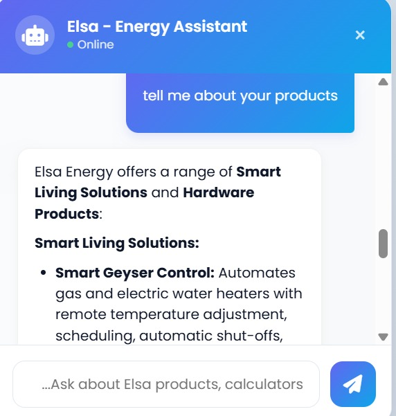

# 🤖 RAG Chatbot Integration

> 💼 **Elsa-Built during my internship for a real client in the smart home / energy management industry.**

A production-ready **Retrieval-Augmented Generation (RAG) Chatbot-Elsa** delivered as an internship project for a client in the smart home and energy management industry. The system pairs a Python FastAPI microservice with a modern, plug-and-play frontend widget designed to drop into any web application (including Laravel).

---

## ✨ Features

- **Semantic Search over a Private Knowledge Base** — documents are chunked, embedded, and retrieved at query time to ground every answer in real company data.
- **Zero Hallucination Architecture** — dynamic system prompts enforce that the LLM only answers from retrieved context.
- **Portable Vector Store** — cosine similarity implemented in pure Python over SQLite; no C++ dependencies, no Docker required.
- **Plug-and-Play Frontend Widget** — a floating chat launcher styled with Glassmorphism (Teal & Indigo tokens) that requires a single `<script>` tag to embed.
- **Conversation Memory** — the frontend maintains full chat history per session for coherent multi-turn dialogue.
- **Custom Markdown Renderer** — lightweight vanilla-JS parser handles bold, italic, bullet lists, and links inside chat bubbles.

---

## 🛠️ Tech Stack

| Layer | Technology |
|---|---|
| Runtime | Python 3.13 |
| API Framework | FastAPI + Uvicorn |
| LLM | Google Gemini 2.5 Flash (`gemini-2.5-flash`) |
| Embeddings | Google Gemini Embedding (`gemini-embedding-001`) |
| Vector Store | SQLite + pure-Python cosine similarity |
| Config | python-dotenv |
| Frontend | HTML5, CSS3 (Glassmorphism), Vanilla JS (ES6+) |

---

## 📂 Project Structure

```
rag-chatbot/
├── README.md
├── .gitignore
├── backend/
│   ├── .env.example          # Environment variable template
│   ├── ingest.py             # Document ingestion & embedding pipeline
│   ├── main.py               # FastAPI server — /chat & /ingest routes
│   ├── requirements.txt      # Python dependencies
│   └── knowledge_base/
│       └── elsa_info.txt     # Source knowledge documents
└── frontend/
    ├── widget.html           # Standalone sandbox for testing
    ├── chatbot.css           # Glassmorphism styling
    └── chatbot.js            # Chat logic, state management, Markdown parser
```

---

## 🚀 Getting Started

### Prerequisites

- Python 3.13+
- A [Google AI Studio](https://aistudio.google.com/) API key with access to the Gemini API

### 1. Clone the repository

```bash
git clone https://github.com/your-username/rag-chatbot.git
cd rag-chatbot/backend
```

### 2. Install dependencies

```bash
pip install -r requirements.txt
```

### 3. Configure environment variables

```bash
cp .env.example .env
```

Open `.env` and add your key:

```env
GEMINI_API_KEY=your_api_key_here
```

### 4. Ingest the knowledge base

```bash
python ingest.py
```

This reads all `.txt` and `.md` files from `knowledge_base/`, splits them into overlapping chunks (800 chars, 100-char overlap), generates embeddings via the Gemini API, and stores them in `vector_store.db`.

### 5. Start the API server

```bash
uvicorn main:app --reload
```

The server will be available at `http://localhost:8000`.

---

## 📡 API Reference

### `POST /chat`

Send a user message and receive a grounded answer.

**Request body:**
```json
{
  "message": "What smart home products does Elsa Energy offer?",
  "history": []
}
```

**Response:**
```json
{
  "response": "Elsa Energy offers..."
}
```

### `POST /ingest`

Trigger a re-ingestion of the knowledge base at runtime.

---

## 🔌 Laravel Integration

### Step 1 — Proxy the API through Laravel

Add a route in `routes/web.php` to avoid CORS issues:

```php
Route::post('/chatbot/message', function (Request $request) {
    $response = Http::post('http://localhost:8000/chat', $request->all());
    return $response->json();
});
```

### Step 2 — Embed the widget

Before the closing `</body>` tag in your Blade layout:

```html
<link rel="stylesheet" href="{{ asset('css/chatbot.css') }}">
<script>
    window.CHATBOT_API_URL = "{{ url('/chatbot/message') }}";
</script>
<script src="{{ asset('js/chatbot.js') }}" defer></script>
```

Copy `chatbot.css` → `public/css/` and `chatbot.js` → `public/js/`.

---

## ⚙️ How It Works

```
User message
     │
     ▼
[Embed query]  ──→  Gemini Embedding API
     │
     ▼
[Cosine similarity search]  ──→  SQLite vector_store.db
     │
     ▼
[Top-3 chunks retrieved]
     │
     ▼
[Dynamic system prompt]  ──→  Gemini 2.5 Flash
     │
     ▼
[Grounded answer returned to frontend]
```

1. The user's query is embedded using `gemini-embedding-001`.
2. Cosine similarity is computed in Python against all stored chunk embeddings.
3. The top 3 most relevant chunks are injected into the LLM system prompt.
4. `gemini-2.5-flash` generates an answer strictly grounded in the retrieved context.

---
## 📸 Screenshot



---

## 🤝 Contributing

Pull requests are welcome. For major changes, please open an issue first to discuss what you'd like to change.

---

## 📄 License

[MIT](LICEN
